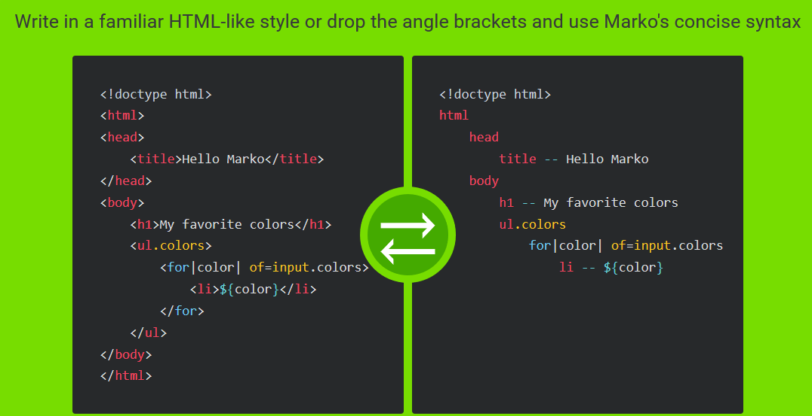

# Advanced Front End Development for (real and) experienced developers 

Previously I outlined beginner back end development in article (here:  )
And now here in part 2, I'll tackle how to effectively do front end development: targeting experienced developers, 7+ years of professional
web development. The 7 years being based on book called: 10K hours to mastery. 
For example, you got your bachelor's in 2013 and have been doing 7 years of paid development in something like PHP, MS ASP, Java JSP or similar web development, that would be an example of 7 years of front end development. Also the degree can be a master degree in graphics design from one of the top schools or similar.
What I am saying to the reader is if you are a jr front end developer this article is not targeting you, but you can likely do beginner back end development as linked at the top - it is much easier to start and master back end - and while doing back end you can get exposed to non-imperative styles of programing, for example using SQL is declarative. 

### How do real developers develop UI/Front End?

When C and C++ developers need GUI the use GUI libs and some of the modern libs they use are declarative:
- Qt/QML
- sciter
- ultralig.ht
- CEF

( Some of the older C/C++ GUI lib like wx, Haxe and GTK are imperative)

Above libs for C/C++ GUI are HTML / DOM based. Html is really a tree/graph of elements.

### SEO (and AMP)

Some apps are secure, but others need to be viral enabled - so we optimize for SEO. Google, Bing and others offer
webmaster / search console tools online - where you can check your page/screen's performance. 
What you have to have resized years ago: you can't use .js client side for anything SEO!

And for improved mobile SEO you may need to render AMP. Again: no .js.

Just HTML and CSS.
You should get the idea that imperative development is mostly for back end and beginners. Imperative is not for advanced and not for front end.

## Real (and fake) front end development and tooling

JAMStack architecture talks about *' prerendered Markup, served without web servers '*. Nice thing about pre-rendered is: SEO :-). No need to dynamically render. No web servers also means fast, served by the edge (CDN) and infinitely scalable. ( Infinitely scalable of the front end; the back end APIs is a different team ).

### Mark up

eBay uses Marko, eg:

So how do we pre-render? 

### Front end frameworks and who to hire

Portfolio

### Confusing? Maybe a bit

## Mastery

